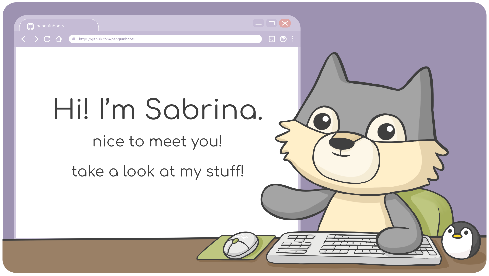

<h1 style="text-align: center">🌸 SABRINA WANG'S GITHUB PORTFOLIO
</h1>



<div align="center">
<a href="https://www.linkedin.com/in/sabrina-y-wang/">
    
</a>
<a href="https://flowcv.com/resume/7vgjugqk7r">
    
</a>
<a href="mailto:sabrina.ynw@gmail.com" target="_blank" rel="noopener noreferrer">
    
</a>
<a href="https://www.wryly.me/">
    
</a>
</div>

<br/>

```javascript
const sabrina = {

  skills: {

    languages: [ javascript, typescript, ruby, java, css, html ],

    frameworksLibraries: [ nodeJS, reactJS, next, sass, tailwind, expressJS, jquery, rails ],

    systemsDatabases: [ postgresql, sql, git, prisma ],

    testing: [ mocha, chai, storybook, jest, cypress, rspec ],

    other: [ photoshop, gSuite, gitHub, figma, vercel ]

  }

  likes: [ art, design, snowboarding, penguins, pastry ]

  currentlyLearning: {

    languages: [ php ],

    frameworksLibraries: [ laravel ],

    systemsDatabases: [ mongodb ]

  }

}
```
<div align="center">
    
</div>

